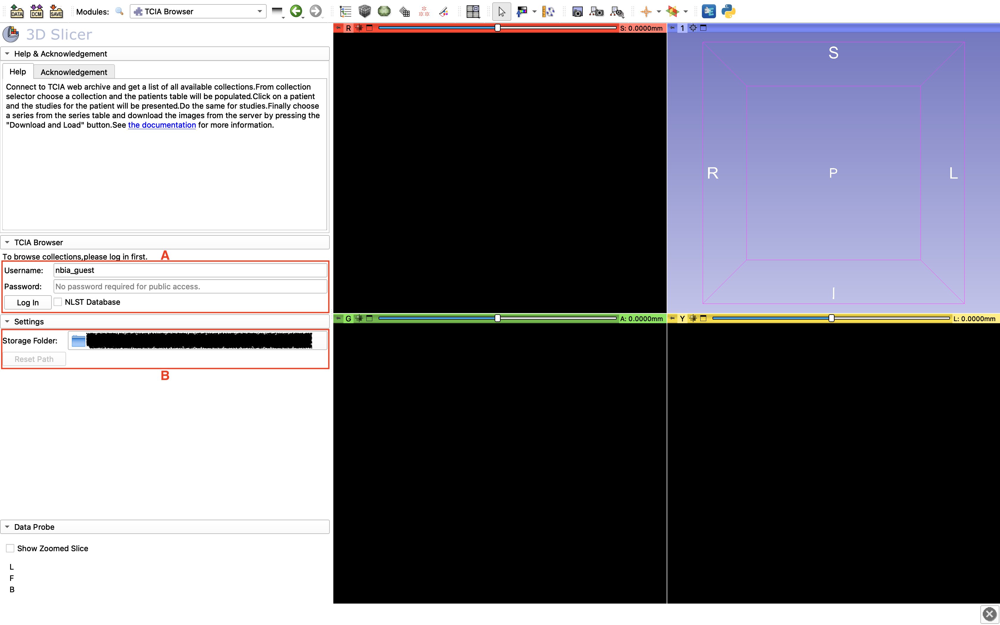
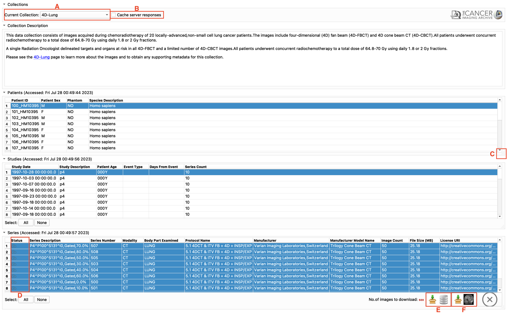
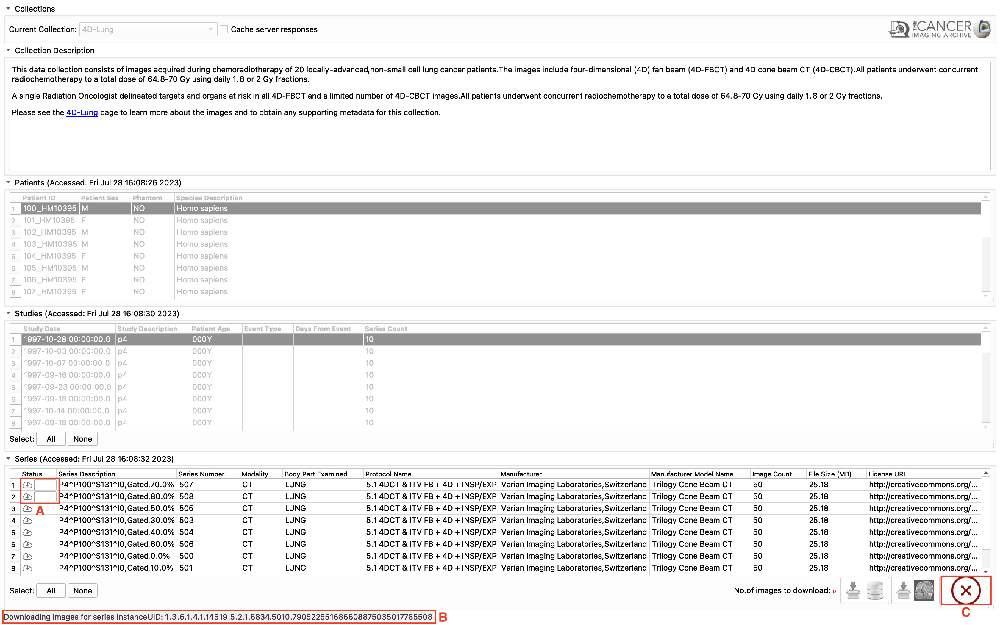

TCIABrowser Documentation
=========================


## Introduction and Acknowledgements
Extension: **TCIABrowser** <br>
Extension Category: Informatics <br>
Acknowledgments: This work is funded by the National Institutes of Health, National Cancer Institute through the Grant Quantitative Image Informatics for Cancer Research (QIICR) (U24 CA180918) (PIs Kikinis and Fedorov). <br>
Contributors: Alireza Mehrtash(SPL), Andrey Fedorov(SPL), Adam Li(GU), Justin Kirby(FNLCR) <br>
Contact: Alireza Mehrtash, <email>mehrtash@bwh.harvard.edu</email>; Justin Kirby, <email>kirbyju@mail.nih.gov</email> <br>
License: [Slicer License](https://github.com/Slicer/Slicer/blob/main/License.txt) <br>


## Module Description


The Cancer Imaging Archive (TCIA) hosts a large collection of Cancer medical imaging data which is available to public through a programmatic interface (REST API). TCIA Browser is a Slicer module by which the user can connect to the TCIA archive, browse different collections, patient subjects, studies and series, download the images and visualize them in 3D Slicer.<br>
[TCIA metrics dashboard](https://www.cancerimagingarchive.net/dashboard2/) provides extensive details on the types of imaging data by anatomy and other characteristics that are available within TCIA.


## Panels and their use
* #### Settings
> By opening TCIABrowser module it will show the settings. There are two settings currently available: Account and Storage Folder.
> By default, the username file is filled by "nbia_guest" with empty password field.
> If you want to just browse and download public data, click "Login" and proceed.
> To access the NLST(National Lung Screening Trial) dataset, simply check the "nlst" box and proceed with the default login information.
> When the "nlst" box is checked, all entered account information will be discarded.
> To change where images are downloaded to, simply click the folder box and change the path.
> To reset the storage folder back to its original location, click "Reset Path".
> When done using the browser, click "logout" to exit, or click "Show Browser" to check other available datasets.
<div class="screenshots" style="border: 3px solid black;">
    
    <ul>
        <li>A: Login area</li>
        <li>B: Storage location</li>
    </ul>
</div>

* #### Browsing Collections, Patients and Studies
> After loggin into an account it will connect to the the TCIA server and list all of the available collections.
> First from the "Current Collection" combobox select a collection.
> The browser will get the patient data from the TCIA server and will populate the patients table.
> The use Cache checkbox will cache the query results on your hard drive which makes further recurring queries faster.
> If direct query from TCIA server is desired the user can uncheck this box. In case of caching server responses the latest access time is provided for each table separately.
> Further selecting a patient will populate the study table for the selected one and selecting a study will update the series table.
<div class="screenshots" style="border: 3px solid black;">
    
    <ul>
        <li>A: Collection selector combobox</li>
        <li>B: Cache server response to the local storage</li>
        <li>C: Tables are expandable</li>
        <li>D: Status of the series (Available on local database / Available on TCIA server)</li>
        <li>E: Download and Index to the Slicer DICOM database (local storage)</li>
        <li>F: Download and load into the Slicer scene</li>
    </ul>
</div>

* #### Downloading Series
> After selecting at least one series the download icons will become activated.
> Pressing the "Download and Index" button will download the images from TCIA to your computer and index the DICOM files inside 3D Slicer DICOM database.
> So you can review them, check the meta-data and load into the scene later with Slicer DICOM module.
> Pressing the "Download and Load" button will download the images and load them into the Slicer scene.
> You can select multiple items from all of the tables.
> By holding the Ctrl key and clicking on different patients, the studies for all the selected ones will be added to the studies table.
> You can select all the studies by pressing 'Select All' button or make a specific selection by Ctrl+Click and all the available series for download will be added to the series table.
> At the final step you will select series for download from the series table.
> The total number of images for the selected series is indicated at the bottom right corner of series table.
> After pressing the download button you can check the download status of each series at the 'Download Status' collapsible button at the module's widget.
> While the download is in progress you can still browse and add other series to the download queue or view the downloaded images in the 3D Slicer Scene.
<div class="screenshots" style="border: 3px solid black;">
    
    <ul>
        <li>A: Progress bars showing download status of the selected series</li>
        <li>B: Status bar showing the current process and the status of server responses</li>
        <li>C: Cancel downloads button</li>
    </ul>
</div>

## Similar Modules
- [SNATSlicer](https://github.com/NrgXnat/XNATSlicer.git)
<br>
- [DICOM](https://slicer.readthedocs.io/en/latest/user_guide/modules/dicom.html)

## Reference
- [Quantitative Image Informatics for Cancer Research (QIICR)](http://qiicr.org/)
- [Quantitative Imaging Network (QIN)](http://imaging.cancer.gov/programsandresources/specializedinitiatives/qin)
- [TCIA Home Page](http://cancerimagingarchive.net/)
- [cBioPortal for Cancer Genomics Web Interface](https://docs.cbioportal.org/web-api-and-clients/)
- [Description of TCIA Collections](https://wiki.cancerimagingarchive.net/display/Public/Collections)
- [TCIA Rest API Documentation](https://wiki.cancerimagingarchive.net/display/Public/TCIA+Programmatic+Interface+REST+API+Guides)
- [Project page at NAMIC 2014 Project Week](http://www.na-mic.org/Wiki/index.php/2014_Project_Week:TCIA_Browser_Extension_in_Slicer)
- [Rapid API page for testing TCIA API endpoint](https://rapidapi.com/tcia/api/the-cancer-imaging-archive/)


## Information for Developers
**[Source Code](https://github.com/QIICR/TCIABrowser.git)**
<br>
Extension Dependencies:
- [QuantitativeReporting](https://qiicr.gitbook.io/quantitativereporting-guide/)
- [SlicerRT](http://slicerrt.github.io)

Checking the API from the python console:
```
import TCIABrowserLib as tblib
client = tblib.TCIAClient.TCIAClient()
response = client.get_collection_values()
print(response_string)
```