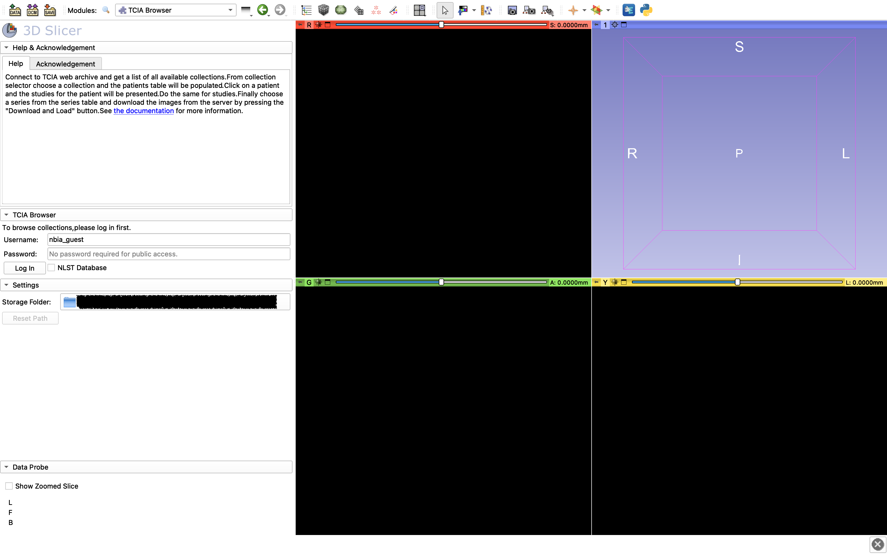
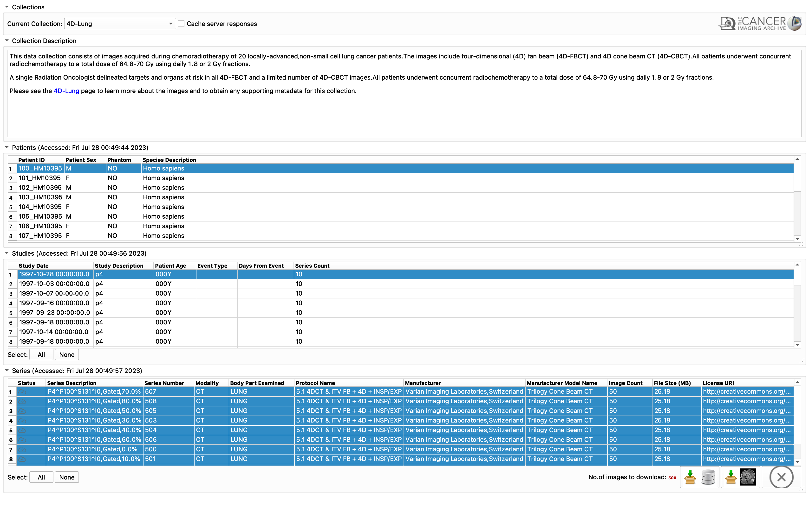

TCIABrowser
===========

## Introduction
TCIABrowser is a [3D Slicer](http://slicer.org/) module for browsing and downloading medical imaging collections from [The Cancer Imaging Archive (TCIA)](http://www.cancerimagingarchive.net/). See [documentation](http://wiki.slicer.org/slicerWiki/index.php/Documentation/Nightly/Extensions/TCIABrowser) for more information.

<!------>

## Acknowledgments
This work is supported in part by the following National Institutes of Health grant:

* Quantitative Image Informatics for Cancer Research [QIICR](http://qiicr.org/) (U24 CA180918, PIs Kikinis and Fedorov)

## Contributors:
* Alireza Mehrtash, Brigham and Women's Hospital
* Andrey Fedorov, Brigham and Women's Hospital
* Adam Li, Georgetown University
* Justin Kirby, Frederick National Laboratory for Cancer Research

## License
* [Slicer License](http://www.slicer.org/pages/LicenseText)
